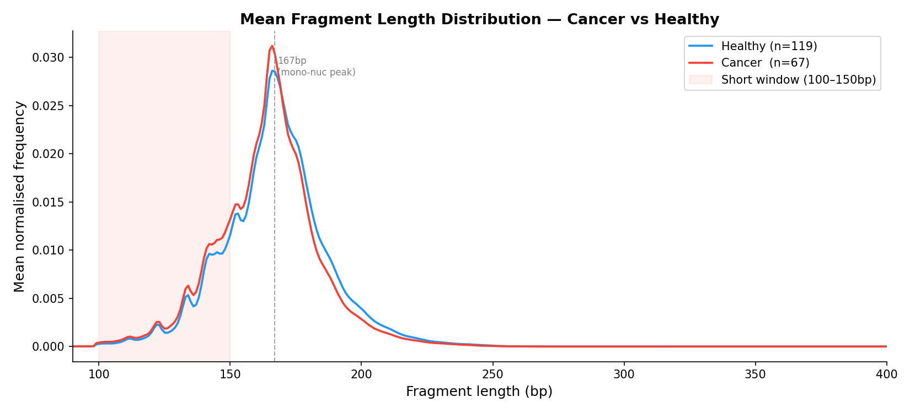
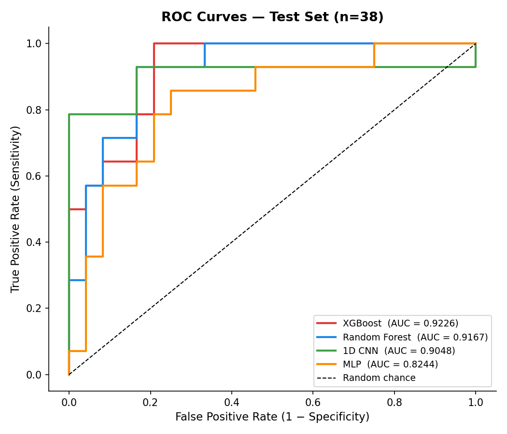

# cfDNA Fragmentomics Cancer Classifier

## Background

Cell-free DNA (cfDNA) fragments released into the bloodstream carry the nucleosome positioning signature of the cell they came from. In cancer, disrupted chromatin architecture shifts the fragment length distribution — fewer nucleosome-protected 150–220 bp fragments, more sub-nucleosomal 100–150 bp fragments. Cristiano et al. 2019 (*Nature*) showed these fragmentation patterns alone are sufficient to detect cancer in blood without mutation calling or methylation profiling.

---

## Dataset

- **Source:** Cristiano et al. 2019, accessed via FinaleDB
- **Samples:** 119 healthy controls, 67 lung cancer patients (HiSeq 2000, WGS)
- **Features extracted from chromosome 1** — representative fragment length profile at ~11× lower cost than whole-genome; proportions are normalised and depth-independent
- **Matched depth:** healthy 3.6M, cancer 3.4M fragments — sequencing depth not a confound
- **QC:** minimum 90 bp, MAPQ ≥ 30; single-cohort design removes inter-batch effects

---

## Methods

- **Features:** 311-feature 1 bp histogram (CNN), 13 bins + 5 scalars = 18 tabular features (RF / XGB / MLP)
- **Scalars include** Cristiano exact SFR: count(100–150 bp) / count(151–220 bp)
- **Split:** stratified 80/20, random_state=42, StandardScaler fit on train only
- **Tuning:** grid search, 5-fold stratified CV on 148 training samples, test set locked
- **Class imbalance:** `class_weight='balanced'` (RF, MLP), `scale_pos_weight` (XGB), `pos_weight` in loss (CNN)
- **Validation:** permutation test, 500 shuffles, before test set unlock

---

## Results

| Model | CV AUC | Test AUC | 95% CI | Sens @95% spec | Perm p |
|-------|--------|----------|--------|----------------|--------|
| 1D CNN | 0.899 | 0.905 | [0.742–1.000] | 78.6% | 0.006 |
| Random Forest | 0.839 | 0.917 | [0.814–0.986] | 57.1% | 0.002 |
| XGBoost | 0.811 | 0.923 | [0.828–0.987] | 57.1% | n/a |
| MLP | 0.821 | 0.824 | [0.662–0.949] | 35.7% | n/a |

*Permutation test run on RF and CNN only (best CV model + strongest tabular baseline).*

*Sensitivity figures reported at 95% specificity threshold. At the default 0.5 threshold, CNN sensitivity = 85.7% at 83.3% specificity.*

**CNN selected as primary model: highest cross-validation AUC and clinical sensitivity.**




---

## Key Findings

- **Nucleosome depletion drives detection:** SHAP shows cancer is detected through depleted 150–220 bp bins, not short-fragment accumulation — consistent with the DELFI mechanism.
- **Cancer fragmentation is heterogeneous:** cancer SFR std = 0.078 vs healthy 0.048, reflecting differences in tumour fraction and stage across patients.
- **SFR is redundant when bins are available:** strong univariate signal (p = 1.4 × 10⁻⁸) but low SHAP rank — individual bins encode the same information more precisely.

---

## Limitations

- **Chr1 only** — not full-genome DELFI windowing; fragment length patterns may differ across chromosomes.
- **Single cohort** — no independent validation set; test AUC CIs are wide at n=38.
- **Lung cancer only** — generalisation to other cancer types untested.
- **No tumour fraction stratification** — early-stage cases with low ctDNA fraction likely underperform.

---

## Reproduce

1. Clone the repository
```bash
git clone https://github.com/VinaySampath14/cfdna-fragmentomics.git
cd cfdna-fragmentomics
```

2. Install dependencies
```bash
pip install -r requirements.txt
```

3. Download data from [FinaleDB](http://finaledb.research.cchmc.org) — place `.frag.tsv.bgz` files in `Healthy/` and `Cancer/`

4. Run feature extraction
```bash
python src/run_extraction.py --chrom chr1 --no-prompt
```

5. Run notebooks in order
```
eda.ipynb → 01_split.ipynb → 02_random_forest.ipynb → 03_mlp.ipynb
→ 04_cnn.ipynb → 05_permutation_test.ipynb → 06_evaluation.ipynb → 07_shap.ipynb
```

---

## References

Cristiano S, et al. *Genome-wide cell-free DNA fragmentation in patients with cancer.* Nature. 2019;570(7761):385–389.

Snyder MW, et al. *Cell-free DNA comprises an in vivo nucleosome footprint that informs its tissues-of-origin.* Cell. 2016;164(1-2):57–68.
